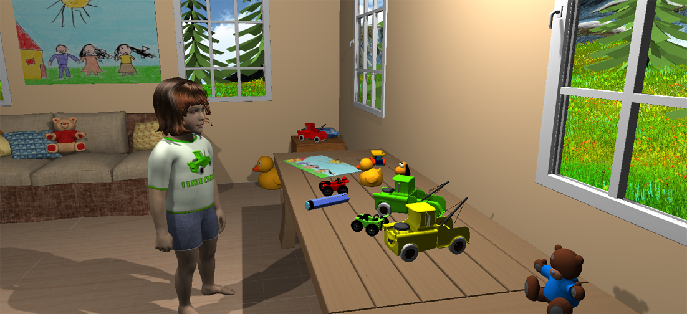

## Burkhardt2023_Spacecog



This repository contains the source code for:
> Burkhardt et al. (2023). A Large-scale NeurocomputationalModel of Spatial Cognition Integrating Memory with Vision. Submitted to Neural Networks.

The provided code integrates three previously published neurocomputational models:

> Bicanski, A., & Burgess, N. (2018). A neural-level model of spatial memory and imagery. Elife, 7, e33752.

[](https://elifesciences.org/articles/33752)

> Bergelt, J., & Hamker, F. H. (2019). Spatial updating of attention across eye movements: A neuro-computational approach. Journal of Vision, 19(7), 10-10.

[](https://jov.arvojournals.org/article.aspx?articleid=2738231)

> Beuth, F. (2019). Visual attention in primates and for machines - neuronal mechanisms (Doctoral dissertation, Department of Computer Science. Technische Universität Chemnitz). 

[](https://nbn-resolving.org/urn:nbn:de:bsz:ch1-qucosa2-356553)

### Authors

see AUTHORS.

### Quickstart

A Linux/GNU operating system is required to run the model.

You first need to install the required packages listed in the requirements.txt (this might depend on how you manage your Python environment):
```
pip3 install -r requirements.txt --user
```

From the *combined/* foder, you should then be able to run
```
python3 combined.py -j16
```
which will initially create and save some large projections between neural populations and then perform a default simulation. This will take a while, depending on your system.

### Further usage

The model generally requires the Unity game engine to provide a virtual environment and the cognitive agent. However, it is possible to run simulations from pre-saved data, which is included in this repository.

For more in-depth instructions please read the documentation in the *docs/site* folder by opening the index.html file. This includes information about:

 - Installing and setting up the model in different environments
 - Installing and setting up the Unity virtual environment
 - General instructions about the usage of the model
 - Overview for the folder structure of this repository and some descriptions for important files

### Folder structure

 - combined: main files for the integrated model
 - SM: Spatial memory and imagery model (Bicanski & Burgess, 2018)
 - LIP: LIP model (Bergelt & Hamker, 2019)
 - VIS: Visual model (Beuth, 2019)
 - UnityVR: Unity environment and network interface

### License
This script is licensed under the GPLv3 License. You should have received a copy of the GNU General Public License along with this program. If not, see <https://www.gnu.org/licenses/>