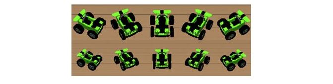

# File Structure
This section will give you a brief introduction to all the individual scripts.

## General structure

* *combined/*: main files for the integrated model
    * *Results/* -> folder for simulation results
    * **combined.py -> main simulation file, integrates all model parts and runs the simulation**
    * combinedHelper.py -> helper functions for visualization, video generation, and evaluation
    * combinedNet.py -> connects the VIS and LIP models (when generating connections)
    * combinedNet_loadConn.py -> connects the VIS and LIP models (when loading conections)
    * combinedVis_LIP.py -> main functions for the integrated use of the LIP and VIS models
    * config.yaml -> config file for the network
* *SM/*: Spatial memory and imagery model (Bicanski & Burgess, 2018)
    * *data_from_training/* -> pre-generated weights for the SM model
    * *targets*/ -> target stimuli for plotting
    * SM_BoundaryCueing.py -> cue with spatial boundaries
    * SM_PdrivePW_withObj.py -> spatial updating with objects
    * SM_helper_functionsp.y -> helper functions for cueing and coordinate systems
    * SM_init.py -> inits the network
    * SM_integrated -> integrated SM functions for the main simulation
    * SM_load_mat_files.py -> loads weights
    * SM_network.py -> connections between SM populations
    * SM_neuron_model -> neuron models for the SM model
    * SM_parameters.py -> parameters
    * SM_roomGridPositionS.py -> get live positional data for objects (only for 3 targets)
    * SM_updateWTS2.py -> update weights after encoding an object
    * SM_visualize.py -> visualization and plotting
    * SM_vr_functions.py -> interactions with Unity
* *LIP/*: LIP model (Bergelt & Hamker, 2019)
    * LIP_connectionPattern.py -> creates custom connection patterns between populations
    * LIP_generateSignals.py -> generates eye position and attention signal
    * LIP_network.py -> neuron models and connections between populations (generate)
    * LIP_network_loadConn.py -> neuron models and connections between populations (load)
    * LIP_parameters.py -> parameters
* *VIS/*: Visual model (Beuth, 2019)
    * *Data/* -> pre-trained weights for the three target objects
    * VIS_Connections.py -> custom connections between VIS populations
    * VIS_InitializationVR.py -> initializes parameters for V1 preprocessing
    * VIS_MainHelperVR.py -> helper functions for VIS model
    * VIS_Network.py -> neuron models and connections between population
    * VIS_ParamVR.py -> Unity related parameters
    * VIS_PreprocessingVR.py -> prepares the pre-processed image
    * VIS_SaccGenVR.py -> saccade generator
    * VIS_SaveResultsVR.py ->savig and plotting
    * VIS_VisualVR.py -> visualization functions
    * VIS_funcitons.py -> additional helper functions
    * VIS_parameters.py -> main parameters for the network
* *UnityVR/*: Unity environment and network interface
    * newAgentBrain -> python side of network interface built with protcol buffers
    * unity2019 -> Unity project to be run on a separate windows machine

## Python

#### combined.py

This is the main file of the model. After importing all necessary modules including ANNarchy and the Network Interface, the network is compiled. It then executes the individual steps of the simulation numbered from 1-6:

1. walk to target object
2. get position of target object
3. encode target object 
4. walk to different position
5. recall target object
6. execute saccade

#### Weights

The model contains two sets of weights.

1. SM model
2. VIS model

<strong>SM Model</strong>

The weights of the SM model can be calculated with the MATLAB script from the eLife publication:

		https://github.com/bicanski/HBPcollab/tree/master/SpatialEpisodicMemoryModel-v1.0

With some work, some other geometries should be possible as well. 
	

<strong>VIS</strong>
	
The VIS model needs pre-learned weights for object localization which were generated with the one-shot learning procedure (Beuth, 2019). They are stored in *VIS/Data/3obj_5rot_2size.mat* and contain

1. Three objects: Green and yellow crane, green racecar
	

2. 5 rotations and 2 sizes for each object
	

This selection is a pretty good fit for not only computational speed but also for robustness, as the VIS model gets very nervous with the small sizes of the 
objects being included into the weights. 

If different sizes and rotations are needed, you can create them from *weightsObjLoc.mat*. With a shape of 180x1505, the ordering along the first dimension is:

* 1-60: yellow crane
* 61-120: green crane
* 121-180: green racecar
* Within each object: 12 rotations (counter-clockwise, starting with the object facing the camera) and five sizes, starting with the largest size

## Unity
This section will give you a brief introduction to all the individual Unity scripts.

### *unity2019/*

This folder contains the complete Unity project including networking scripts. 
The most important parts are the *Assets/* folder and then *APPConfig.config*

#### APPConfig.config
This file includes some config parameters. The most important ones are:

		<LocalPort>1337</LocalPort>     	// Unity port
        <IPAddress>192.168.0.12</IPAddress> // Local IP
		<sphericalProjection>true</sphericalProjection>  // use the spherical projection

#### Assets/

All Unity assets, scripts and the shperical projection shader are in this folder.
Useful scripts might be (and contain among other things):

* AgentScript.cs -> Mostly eye and body movements of the agent
* BehaviourScript.cs -> Main control class for the environment, change your IP here
* SpatialCognitionAgentScript.cs -> Agent movement on specific path
* SpatialCognitionBehaviourScript.cs -> Shader, A* search, initial agent position